# Contributing to IPO Lens

Five of us are building this over two weeks, often on different parts at once. This file explains how we track who is doing what and keep anyone's work from being overwritten.

## The short version

Every piece of work is a **step**: one issue, one branch, one pull request and one step record.

```mermaid
%%{init: {"theme":"base","themeVariables":{"background":"#FFFFFF","primaryColor":"#FFFFFF","primaryTextColor":"#0B0B0B","primaryBorderColor":"#4F46E5","lineColor":"#4F46E5","secondaryColor":"#EAE9FC","tertiaryColor":"#FFFFFF","textColor":"#0B0B0B","edgeLabelBackground":"#FFFFFF","clusterBkg":"#FFFFFF","clusterBorder":"#CECECE","titleColor":"#0B0B0B","rowOdd":"#FFFFFF","rowEven":"#F0F0F0","attributeBackgroundColorOdd":"#FFFFFF","attributeBackgroundColorEven":"#F0F0F0","actorBkg":"#FFFFFF","actorBorder":"#4F46E5","actorTextColor":"#0B0B0B","actorLineColor":"#919191","signalColor":"#4F46E5","signalTextColor":"#0B0B0B","labelBoxBkgColor":"#FFFFFF","labelBoxBorderColor":"#4F46E5","labelTextColor":"#0B0B0B","loopTextColor":"#0B0B0B","noteBkgColor":"#E5E3FB","noteTextColor":"#0B0B0B","noteBorderColor":"#4F46E5","activationBkgColor":"#4F46E5","activationBorderColor":"#4F46E5"}}}%%
%% palette 97d170e1
flowchart LR
  A[Issue<br/>#14] --> B[Branch<br/>step/014-...] --> C[Commits<br/>Step: #14] --> D[Step<br/>record] --> E[Pull<br/>request] --> F[Teammate<br/>approves] --> G[Merge<br/>commit]
  classDef role1 fill:#E3E1FB,stroke:#4F46E5,color:#0B0B0B
  classDef role3 fill:#F4E6DA,stroke:#BC641A,color:#0B0B0B
  classDef role4 fill:#E3F4DA,stroke:#52BC1A,color:#0B0B0B
  class A,B,C,D role1
  class E,F role3
  class G role4
```

<!-- Diagram colours: neutral palette from the ship palette script. No stylesheet, manifest or logo exists yet to take colours from. -->


## 1. Claim the work

Open an issue with the **Step** template and assign it to yourself. The issue number is the step ID. GitHub hands out the numbers, so two people can't claim the same one, and the issue board always shows who's working on what.

### Step numbers work like ticket numbers

Nobody picks a number by hand. Creating the issue is what reserves the number, and GitHub always gives the next free one.

- **To hand out work ahead of time**, create the issues in advance and assign them. If Sourav creates four issues and they come out as #7 to #10, assigning #7 and #8 to himself and #9 and #10 to Divyansh reserves those numbers for them.
- **Numbers skip.** Pull requests share the counter with issues, so after issue #7 its PR might take #8. That's expected. Nothing needs to be consecutive.
- **Everything about a step carries its number:** branch `step/007-...`, record `docs/steps/007-...md`, commits ending `Step: #7`, and the PR that says `Closes #7`. The branch and record use three digits so they sort in order.
- **To go back to an old step**, open issue #7 on GitHub. It links the PR, the commits and the branch. You can also read `docs/steps/007-*.md` or run `git log --grep "Step: #7"`. Merged branches are deleted automatically, but nothing is lost: the merge commit keeps the branch name, and the PR page has a "Restore branch" button.

## 2. Branch

```bash
git switch main
git pull
git switch -c step/014-play-reviews
```

The branch name is `step/`, then the issue number padded to three digits, then a few words in lowercase with hyphens. Issue #14 becomes `step/014-play-reviews`, and issue #7 becomes `step/007-...`.

## 3. Commit

Every commit message ends with a `Step:` line:

```
Parse Play Store reviews into monthly ratings

Reviews arrive newest first, so we page until we pass the 12-month window.

Step: #14
```

Keep the subject under 72 characters, write it as an instruction ("Add", "Fix", not "Added"), and use the body to explain why. Co-author lines are only for teammates who worked on the commit.

To bring in new work from `main`, merge it (`git merge main`). Don't rebase commits you've already pushed.

## 4. Write the step record

Copy `docs/steps/_template.md` to `docs/steps/014-play-reviews.md` and fill it in: what you did, which earlier steps it builds on, what you changed in them and why, what's still weak, and what you left for later.

Once a PR is merged, its record is frozen. Nobody edits it again, and the check below enforces that.

## 5. Open a pull request

Push your branch and open a PR. The template asks what the step does, what it builds on and how to check it. Link the issue with `Closes #14`.

## 6. Review and merge

Someone other than the author reviews, approves and merges the PR. GitHub doesn't let authors approve their own PRs, and `main` is protected, so nobody can merge their own work.

Merge with **Create a merge commit**. Squash merges are turned off because they fold every commit into one and lose who wrote what. Rebase merges are off too, so the commits on `main` are the same ones that were reviewed.

## Reviewing without changing the branch

Leave review points as comments. The author makes the change. That keeps each commit authored by the person who wrote it, and keeps the `Step:` line on every commit.

Don't use GitHub's **Commit suggestion** or **Add suggestion to batch** buttons, even on a suggestion you wrote yourself. They commit straight to the author's branch, and a commit made in the browser has no `Step: #<number>` line, so `steps-guard` fails the PR.

Comments from review bots work the same way. Read what they flag and comment in your own words on the ones worth fixing. Never click **Commit suggestion** on a bot's comment either: those commits also add a co-author line for the bot, and co-author lines are only for teammates.

If one lands anyway, the author of the branch removes it. This is the one case where we rewrite a branch that's already pushed, and nobody does it to someone else's branch. A person runs these commands. Coding assistants are blocked from force-pushing.

Start with a clean `git status`, run `git fetch origin`, and note two commit ids: the suggestion commit you're dropping (say `abc1234`) and the one just before it (say `9f8e7d6`).

If your laptop never pulled the suggestion commit, push your branch as it is:

```bash
git push --force-with-lease=step/<NNN>-<slug>:abc1234 origin step/<NNN>-<slug>
```

If you pulled it and it's the newest commit, move back one commit first:

```bash
git switch step/<NNN>-<slug>
git reset --hard 9f8e7d6
git push --force-with-lease=step/<NNN>-<slug>:abc1234 origin step/<NNN>-<slug>
```

Naming the commit after `--force-with-lease` means the push only goes through if that commit is still the newest one on GitHub, so nobody else's work gets overwritten. If the suggestion commit is buried under newer commits, ask in the group chat before doing anything.

If the change was worth keeping, redo it as an ordinary commit ending `Step: #<number>`. Credit a teammate who suggested it with a `Co-authored-by:` line or by name in the commit body. Only teammates get credited.

## Reviews without blocking each other

Five people and one required approval can still leave PRs waiting for days. What keeps them moving:

- **Review buddies.** Each person's PRs go to the next person in the circle first: Divyansh → Sourav → Avi → Anay → Manish → Divyansh. If your buddy hasn't picked it up within 6 hours, anyone else can.
- **Post the link.** When a PR is ready, drop it in the group chat with one line on what it does.
- **Keep PRs small.** One step should take 10 to 15 minutes to review. If yours is much bigger, split the step.
- **Review twice a day.** Check your queue once around lunch and once in the evening, before starting new work.
- **Approve and merge together.** The reviewer who approves also clicks merge, so the author isn't waiting twice.
- **Don't sit on a blocker.** If you need someone's unmerged work, wait for it or ask them. Don't copy their code into your branch.
- **Open drafts early.** A draft PR shows the team what you're doing. Mark it ready when you want a review.

## Daily commands

Once, after cloning:

```bash
git clone <repo URL>
cd <repo folder>
git config user.name "Your Name"
git config user.email "the-email-on-your-github-account@example.com"
cp .env.example .env    # then add your SerpApi key
```

Every new step:

```bash
git switch main
git pull
git switch -c step/014-play-reviews
```

While working:

```bash
git status                       # check what changed before you commit
git add src/ipolens/sources/play.py tests/test_play.py
git commit -m "Parse Play Store reviews into monthly ratings" -m "Step: #14"
git push -u origin step/014-play-reviews    # first push; after that, plain git push
```

Name files in `git add` instead of `git add .`, so `.env` and stray files never sneak in. The second `-m` puts `Step: #14` on its own line at the end, which is where the check looks for it.

When `main` moves on while you work:

```bash
git fetch origin
git merge origin/main
```

After your PR is merged:

```bash
git switch main
git pull
git branch -d step/014-play-reviews
```

**If a push says "protected branch" or "push declined":** you committed on `main` by mistake. Move the work to a step branch, then reset your local `main`:

```bash
git switch -c step/014-play-reviews    # your commits come along to the new branch
git push -u origin step/014-play-reviews
git switch main
git reset --hard origin/main          # only after the push above succeeded
```

## Improving someone else's step

Say step #9 parsed the reviews and you want to rewrite that parser. Don't edit #9's record and don't hide the change inside unrelated work. Open a new step ("Improve review parsing from #9"), make the change there, and use the "Changes to earlier steps" section of your record to say what you changed and why. The history then shows that #9 built the first version and #14 improved it.

## What we never do

- Push straight to `main`
- Force-push, or amend or rebase commits that are already pushed, except to drop a suggestion commit from our own branch
- Commit a review suggestion to someone's branch from the GitHub UI
- Accept a bot's suggestion commit, or credit anyone outside the team as a co-author, contributor or reviewer
- Merge our own PRs, or approve them
- Edit, rename or delete another step's record
- Clean up code that belongs to another step as a side job
- Commit `.env`, API keys, the `cache/` folder, phone numbers, emails, or the names and profiles of reviewers and other people outside the team

## The PR checks

Two checks run on every pull request.

`steps-guard` fails the PR if:

- the branch isn't named `step/<3-digit number>-<words>`
- the PR changes, renames or deletes a record that's already merged
- the PR doesn't add its own record
- a commit is missing the `Step: #<number>` line, or has the wrong number

It skips commits that came in when you merged `main` into your branch.

`lint-and-test` runs Ruff and pytest. Until the project skeleton step adds `pyproject.toml`, it passes without doing anything. Tests use recorded responses, so the check never needs a SerpApi key.

## Keys and data

- Copy `.env.example` to `.env` and put your SerpApi key there. `.env` is gitignored. Each of us uses our own free account.
- SerpApi request URLs contain your key, so never log or print them.
- Recorded responses can include people's names (Play Store reviewers, for example). Remove `search_metadata`, names, avatars and profile links before saving anything under `tests/fixtures/`.
- If a key ever gets committed, say so in the group chat right away and rotate it in the SerpApi dashboard. Removing the line afterwards doesn't take it out of history.

## Working with a coding assistant

Project rules for assistants live in `AGENTS.md`, and each tool's own settings file points there. Whatever tool you use, set it to ask before running `git push`, and never let it approve or merge a PR.

## Repository settings

For the repo owner. Set these once.

**Settings → Rules → Rulesets → the ruleset for `main`**
- Enforcement status: Active. Bypass list: empty.
- Target: the default branch
- Restrict deletions: on
- Block force pushes: on
- Require a pull request before merging: on
  - Required approvals: 1
  - Dismiss stale pull request approvals when new commits are pushed: on
  - Require approval of the most recent reviewable push: on
  - Require conversation resolution before merging: on
  - Allowed merge methods: Merge only
- Require status checks to pass: add `steps-guard` and `lint-and-test` once they've run on the first PR
- Restrict updates: **off**. With an empty bypass list it would block merging PRs too. "Require a pull request" already blocks direct pushes.
- Require linear history: **off**. It rejects merge commits, which is how we merge.

**Settings → General → Pull Requests**
- Allow merge commits: on
- Allow squash merging: off
- Allow rebase merging: off
- Automatically delete head branches: on

**Settings → Code security**
- Secret scanning: on
- Push protection: on

**Settings → Collaborators**
- All five of us with write access
