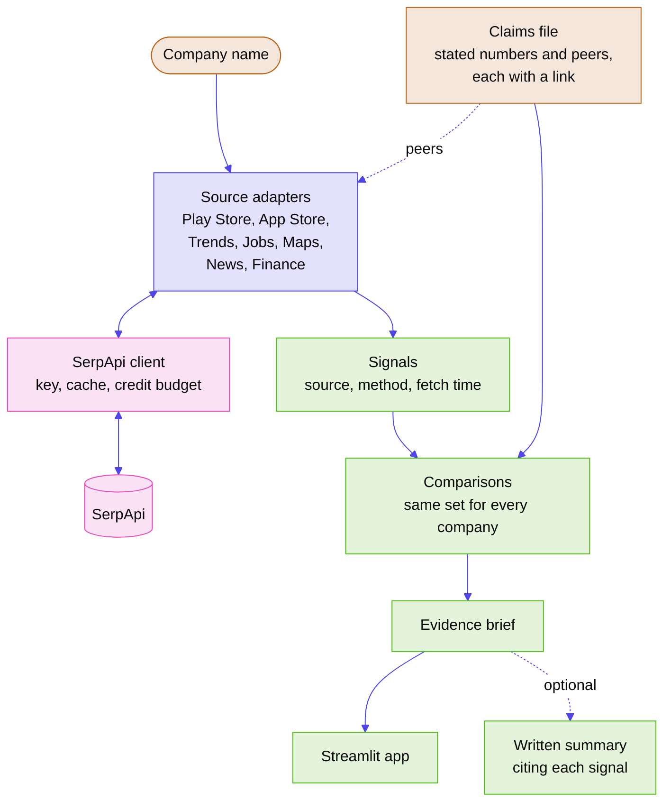
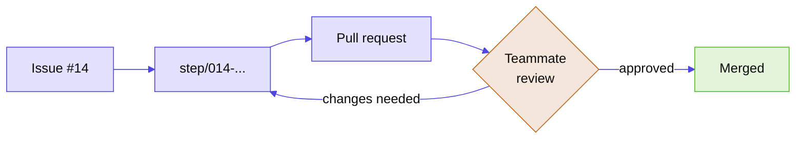

# IPO Lens

**See what customers, job seekers and the news are saying about a company before its IPO, one source at a time.**


A prospectus tells you what a company says about itself. When a consumer brand in India goes public, most retail investors have that and a few headlines to go on. IPO Lens pulls in what everyone else is saying: how customers rate the app, where in India people search for the brand, whether the company is hiring, how its stores are reviewed, and what the press is reporting. Each signal stays separate, with its source, its method and the time it was fetched. It also puts numbers side by side: the rating at the top of a Play Store page next to the ratings in the latest reviews, or the company's store ratings next to those of listed companies in the same business. The app makes no recommendation about whether to apply.

## What it shows

| Signal | Source | What it can tell you | What it can't |
|---|---|---|---|
| App ratings and complaints | Google Play and App Store reviews | How customers rate the app lately, and what they complain about | Whether reviewers represent all customers |
| Search interest by state | Google Trends | Where in India people look the brand up | Why they're searching |
| Hiring | Google Jobs | Which roles and cities the company is hiring for | Headcount or attrition |
| Store ratings | Google Maps | How outlets are rated, city by city | Sales per store |
| Coverage | Google News | What's being reported, and by which outlets | Whether a report is accurate |
| Listed peers | Google Finance | How comparable listed companies have moved | Anything about the IPO's own price |

All of it comes from [SerpApi](https://serpapi.com). The app fetches fresh results the first time you look up a company and saves them after that.

## How it works

<!-- Diagram colours: neutral palette from the ship palette script. No stylesheet, manifest or logo exists yet to take colours from. -->


Each source has its own adapter. An adapter asks one SerpApi engine one kind of question and returns typed results labelled with where they came from.

Only the client module talks to SerpApi. It holds the key, saves every response to disk and counts credits, so the demo and the tests can run from saved responses.

Signals stay separate. A Play Store rating and a Google Maps rating come from different people rating different things, so the app shows them next to each other with the method behind each and never averages them.

Comparisons come after the signals. Each demo company has a short hand-written claims file with the numbers it states about itself and the listed peers named in its offer document, each with a link. Every company gets the same comparisons and all of them are shown. A measure is only compared with the same measure, and the wording says where two numbers differ without calling either one misleading.

The written summary is optional. With an LLM key, the app adds a short summary that cites the signals it uses. Without one, you still get the full brief.

## What it doesn't do

- Tell you to buy, sell, subscribe to or skip an IPO
- Predict listing gains, prices or the grey market premium
- Call a claim misleading. It shows where the claim and the evidence differ and leaves the judgement to you
- Fetch data from anywhere except SerpApi. The one other input is a short hand-written list of each demo company's public claims, each linked to its source

## Status

Early development. We started on 20 September 2026 and are building toward the hackathon deadline on 5 October. [`docs/progress.md`](docs/progress.md) has the current plan, and each finished piece of work has a record in [`docs/steps/`](docs/steps/).

## Running it

Setup instructions will land here with the first runnable version. It will look like this:

```bash
uv sync
cp .env.example .env    # then add your SerpApi key
uv run streamlit run src/ipolens/app.py
```

A free SerpApi account gives 250 searches a month, which is enough to try it out.

## How we work

Every piece of work is a **step**: an issue, a branch, a pull request and a short record of what was done and why. A teammate reviews every PR before it's merged, and nobody merges their own. Once a record is merged, it stays as written, so the history shows who built what and how it improved.

<!-- Diagram colours: neutral palette from the ship palette script. No stylesheet, manifest or logo exists yet to take colours from. -->


[`CONTRIBUTING.md`](CONTRIBUTING.md) has the details.

## Project docs

| Doc | What's in it |
|---|---|
| [`docs/overview.md`](docs/overview.md) | What we're building, who it's for, and what's out of scope |
| [`docs/architecture.md`](docs/architecture.md) | Stack, structure, and the decisions behind them |
| [`docs/standards.md`](docs/standards.md) | How we write code, test it, and keep keys and data safe |
| [`docs/brief.md`](docs/brief.md) | The hackathon's rules and requirements |

## Team

Sourav · Avi · Anay · Manish · Divyansh

Built for the [SerpApi India Hackathon 2026](https://serpapi.github.io/serpapi-india-hackathon-2026/), Commerce & Market Intelligence track.
