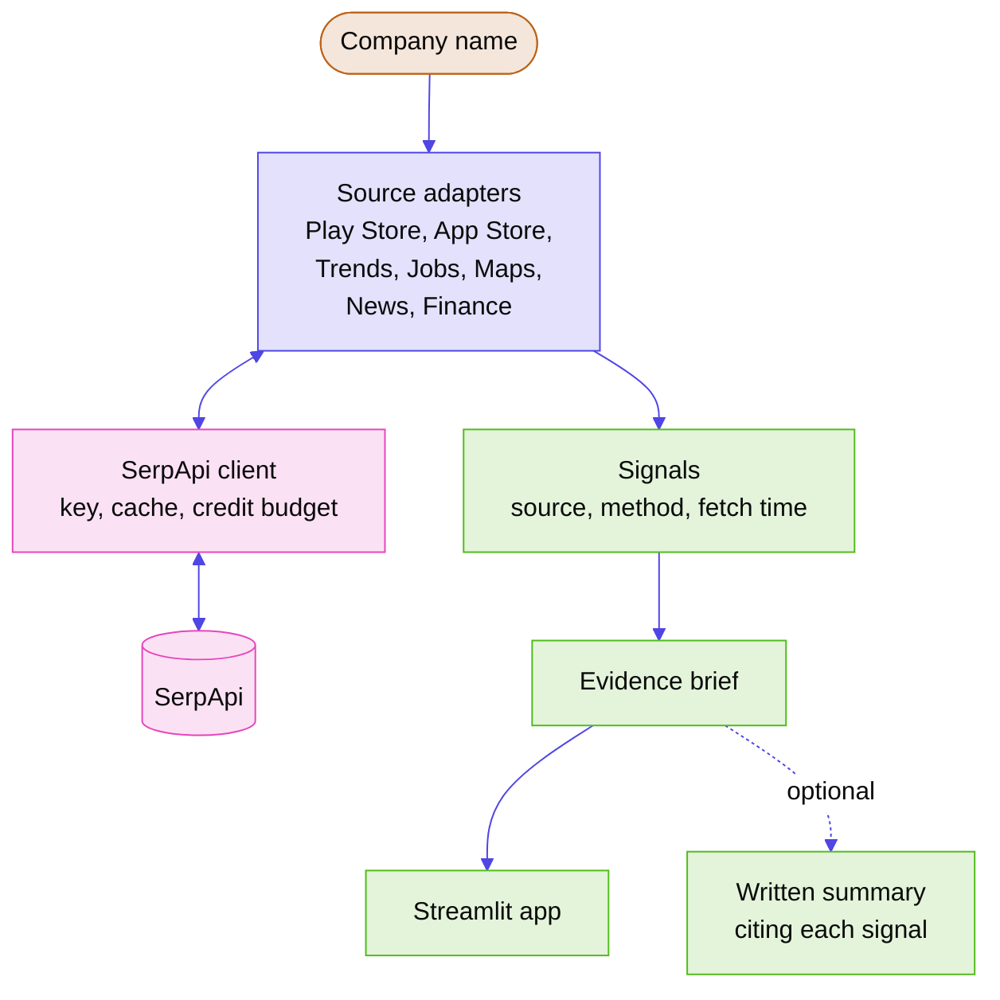

# Architecture

This is a plan. Nothing is built yet. The project skeleton step creates it, and this file should change wherever the real code turns out different.

## Stack

| Layer | Choice | Why |
|---|---|---|
| Language | Python 3.12 or newer | Everyone on the team knows some Python, and SerpApi maintains an official SDK for it |
| Setup and running | uv | `uv sync` sets up, `uv run` runs. One command each |
| SerpApi access | the official `serpapi` package, wrapped by our client module | The key, cache, credit budget and errors are handled in one place |
| Cache | JSON files on disk, one per request | The simplest option that works. Scrubbed copies double as test fixtures |
| Data models | Pydantic | Each source returns typed results that record where they came from |
| UI | Streamlit | The fastest way to a screen we can demo |
| Written summary (optional) | Pydantic AI, with Gemini's free tier by default | The app has to work for someone who has no LLM key |
| Lint and format | Ruff | One tool for both |
| Tests | pytest on recorded, scrubbed responses | Fast and repeatable, and they don't use credits |

## Shape

<!-- Diagram colours: neutral palette from the ship palette script. No stylesheet, manifest or logo exists yet to take colours from. -->


```
src/ipolens/
  serp/client.py   the only module that calls SerpApi: key, cache, budget, errors
  sources/         one adapter per engine, each returning a typed result
  signals/         turns source results into signals, each with a documented method
  brief/           puts the brief together, plus the optional written summary
  app.py           Streamlit UI
tests/
  fixtures/        recorded SerpApi responses with personal data removed
cache/             local response cache, gitignored
```

## Sources

| Signal | Engine | What it can tell you | What it can't |
|---|---|---|---|
| App ratings and complaints | Google Play and Apple App Store reviews | How customers rate the app lately, and what they complain about | Whether reviewers represent all customers |
| Search interest by state | Google Trends, state-level `geo` | Where in India people look the brand up | Why they're searching |
| Hiring | Google Jobs | Which roles and cities the company is hiring for | Headcount or attrition |
| Store ratings | Google Maps and Maps reviews | How outlets are rated, city by city | Sales per store |
| Coverage | Google News | What's being reported, and by which outlets | Whether a report is accurate |
| Listed peers | Google Finance | How comparable listed companies have moved | Anything about the IPO's own price |

### Data check, 2026-09-20

We ran Zepto, Lenskart and boAt through every source with India settings (`gl=in`, `country=in`, `geo=IN`). All seven returned usable data, using 20 searches in total. What we learned:

- Reviews pile up fast. For Zepto and Lenskart, 40 Play Store reviews covered less than a day. The app reads the latest few hundred reviews instead of a year's worth, and the UI says which window it used.
- The headline rating and the latest reviews can disagree. Zepto shows 4.6 on the Play Store, but 16 of its newest 40 reviews there were one star, and so were 20 of its newest 25 on the App Store.
- Trends returned all 35 states and union territories with codes like `IN-DL` and `IN-KA`.
- Jobs returns up to 10 postings per call, and the locations are uneven: a city, a state, or just "India". The app shows them as a sample of current openings and makes no claim about how much a company is hiring.
- Maps picks up lookalikes. A search for "boAt store" also returned resellers and "Hector Beverages (Paperboat)". Outlets have to match the brand name, and the app lists every outlet it counted by name.
- Finance works with NSE tickers such as `NYKAA:NSE`, financials included.
- A full brief for one company should cost roughly 15 searches, so one free account covers about a dozen companies a month. The cache is not optional.

## Decisions

### 2026-09-20: IPO Lens as the project

**Chose:** evidence briefs for upcoming Indian IPOs, entered in Commerce & Market Intelligence.
**Because:** it splits into one data source per person, which suits five people working in parallel. None of the 177 projects in SerpApi's BuiltWithSerpApi gallery does this. It uses engines few projects touch, each for something only that engine provides. The core value doesn't depend on an LLM getting things right.
**Rejected:** a tool comparing what search shows in English against Hindi, Tamil and Telugu. It rests on an LLM judging contradictions across languages, which is hard to make reliable or to demo, and AI Overview coverage in Indian languages is unconfirmed. Also rejected: a TypeScript package of SerpApi tools for agent frameworks. It needs library-design experience, and SerpApi's own team maintains similar packages, which sets a high bar.

### 2026-09-20: Go ahead after the data check

**Chose:** keep IPO Lens.
**Because:** all seven sources returned India data for three real consumer brands, including the two we weren't sure about (Play Store reviews and NSE tickers in Finance).
**Rejected:** switching to the fallback, a TypeScript tools package. We looked at it again and stayed with Python and Streamlit.

### 2026-09-20: Python, uv and Streamlit

**Chose:** a single Python codebase with a Streamlit UI.
**Because:** it's the language the whole team shares, and it's the shortest path to something working and demoable.
**Rejected:** Rails, since nobody on the team has used Ruby. Also a separate JavaScript frontend with an API backend: two codebases to set up and run is more than two weeks allows.

### 2026-09-20: File cache instead of a database

**Chose:** one JSON file per request under `cache/`.
**Because:** nothing needs to query the cache yet. Files are easy to inspect, and scrubbed copies become test fixtures.
**Rejected:** SQLite, for now. Switch if the cache ever needs lookups beyond "have we fetched this exact request".

### 2026-09-20: The written summary is optional

**Chose:** the brief works on its own, and an LLM summary is an add-on.
**Because:** judges may run it without an LLM key, and the evidence has to stand up without an LLM's interpretation.
**Rejected:** making the LLM required.

### 2026-09-20: No recommendations, no single score

**Chose:** show each signal separately with its method.
**Because:** it's the honest way to present data from different sources, and it keeps the product clear of anything that looks like investment advice.
**Rejected:** an overall "IPO score". It blends sources that don't compare and reads as advice.

### 2026-09-20: Steps and merge commits

**Chose:** one issue, branch, PR and frozen record per piece of work. PRs merge with merge commits after a teammate approves.
**Because:** it keeps a clear record of who did what, and earlier work gets improved in new steps instead of being overwritten.
**Rejected:** squash merging, which folds several commits into one and loses who wrote what. Also rejected: a shared progress table, which five people would keep hitting merge conflicts in.
